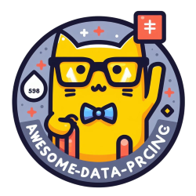

# Awesome Data Pricing 

> A curated list of awesome resources, tools, and projects related to data pricing.

## Contents

- [Awesome Data Pricing](#awesome-data-pricing)
  - [Contents](#contents)
  - [Books](#books)
  - [Papers](#papers)
  - [Tools](#tools)
  - [Articles](#articles)
  - [Courses](#courses)
  - [Videos](#videos)
  - [Case Studies](#case-studies)
  - [Contributing](#contributing)

## Books

- [Book Title 1](LINK) - Description of this book and what it covers regarding data pricing.
- [Book Title 2](LINK) - Description of this book and what it covers regarding data pricing.

## Papers

- [Paper Title 1](LINK) - Description of this paper and its findings on data pricing.
- [Paper Title 2](LINK) - Description of this paper and its findings on data pricing.

## Tools

- [Tool Name 1](LINK) - Description of this tool and how it can be used for data pricing.
- [Tool Name 2](LINK) - Description of this tool and how it can be used for data pricing.

## Articles

- [Article Title 1](LINK) - Description of this article and its insights on data pricing.
- [Article Title 2](LINK) - Description of this article and its insights on data pricing.

## Courses

- [Course Title 1](LINK) - Description of this course and what it teaches about data pricing.
- [Course Title 2](LINK) - Description of this course and what it teaches about data pricing.

## Videos

- [Video Title 1](LINK) - Description of this video and what it covers regarding data pricing.
- [Video Title 2](LINK) - Description of this video and what it covers regarding data pricing.

## Case Studies

- [Case Study 1](LINK) - Description of this case study and its findings on data pricing.
- [Case Study 2](LINK) - Description of this case study and its findings on data pricing.

## Contributing

Your contributions are always welcome! Please read the [contribution guidelines](CONTRIBUTING.md) first.
